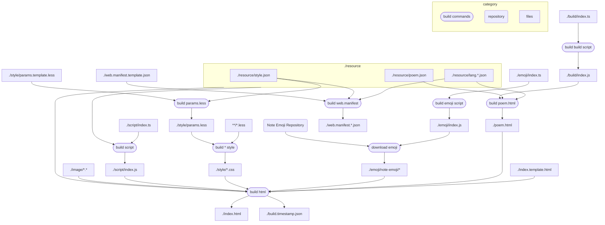

# Cyclic ToDo

🚧 This static web application is under development. / この Static Web アプリは開発中です。

## Features

- ✅️ Lifelog as ToDo List. / ToDo リストとしてのライフログ。
- ✅️ Automatically predict task cycle. / タスク周期を自動予測。
- ✅️ Sublists and tags. / サブリストとタグ。
- ✅️ Static Single Page Web Application. / 静的シングルページウェブアプリケーション。
- ✅️ Supports PCs and smartphones. / PCとスマフォをサポート。
- 🚫 OneDrive sync. / OneDrive 同期。
- ✅️ Data import and export in JSON / JSON でのデータインポートとエクスポート。
- ✅️ ダークモード対応
- ✅️ 多言語対応

## Concepts

- Don't blame the user. / ユーザーを責めない。
- Encourage users. / ユーザーを勇気づける。
- Just record the log and display it. / ひたすらログを記録しそれを表示するだけ。

## Other ToDo applications

Cyclic ToDo do not support cloud sync, single-shot tasks, trees, due dates, notifications, etc. If necessary, please use the following ToDo apps together. / Cyclic ToDo はクラウド同期、単発の ToDo、ツリー、期限、通知などをサポートしません。必要に応じて以下のような ToDo アプリを併用してください。

- [OmniFocus](https://web.omnifocus.com/)
- [Microsoft To Do](https://to-do.live.com/)
- [Apple Reminders](https://www.icloud.com/reminders)
- [Google Keep](https://keep.google.com/)

## Development environment construction

0. Install [Visual Studio Code](https://code.visualstudio.com/) ( Not required, but recommended. )
1. Install [Node.js](https://nodejs.org/ja/)
2. Execute `npm install`.

## Build commands

( You can see this diagram in VS code with [Markdown Preview Mermaid Support extension](https://marketplace.visualstudio.com/items?itemName=bierner.markdown-mermaid). )

- `npm run-script "build all"`
- `npm run-script "build html"`
- `npm run-script "build style"`
- `npm run-script "build script"`
- `npm run-script "debug build all"`
- `npm run-script "debug build style"`
- `npm run-script "debug build script"`
- `npm run-script "build emoji script"`: for "download emoji"
- `npm run-script "download emoji"`
- `npm run-script "build build script"`: for "build poem.html"
- `npm run-script "build poem.html"`
- `npm run-script "watch script"`

Debug builds embed map files.

## Files

|path|description|
|---|---|
|[`./build.js`](./build.js)|build command script.|
|[`./build.json`](./build.json)|build settings.|
|[`./index.html`](./index.html)|This file is genereted by build.js|
|[`./index.template.html`](./index.template.html)|HTML template|
|[`./resource/images.json`](./resource/images.json)|define image files.|
|[`./resource/lang.en.json`](./resource/lang.en.json)|English language data.|
|[`./resource/lang.ja.json`](./resource/lang.ja.json)|Japanese language data.|
|[`./style/index.less`](./style/index.less)|style source file|
|[`./script/index.ts`](./script/index.ts)|script source file|

## How to publish

1. Fork [this repository](https://github.com/wraith13/cyclic-todo/) on GitHub.
2. Go `Settings`(→`Options`)→`GitHub Pages`, select `master branch` from drop down list, and click `Save`.

## License

[Boost Software License](./LICENSE_1_0.txt)

### Noto Emoji's License

[SIL OPEN FONT LICENSE Version 1.1](./emoji/noto-emoji/LICENSE)
